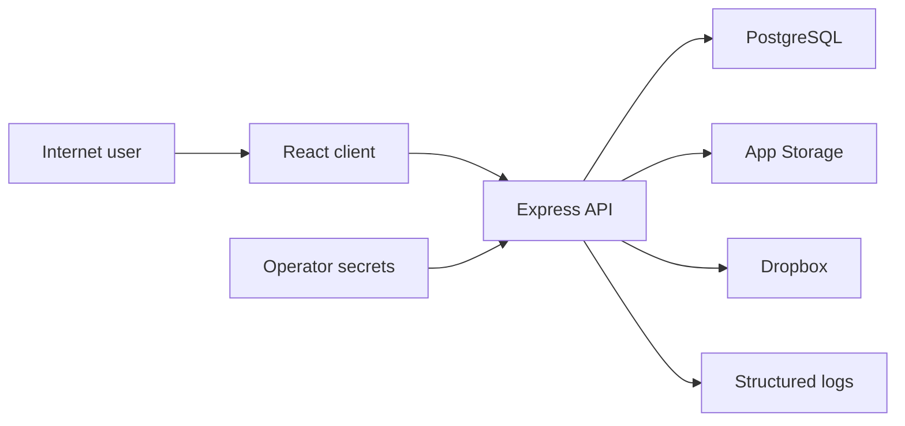

# Master-Brief Threat Model

## Executive summary

For this internet-reachable but invite-only single-tenant system, the
highest-value review areas are account onboarding/reset, session and
authorization enforcement, project/file IDOR boundaries, and third-party
storage credentials. Existing deny-by-default authorization, server-side
sessions, unsafe-method Origin validation, explicit parser limits, and bounded
database readiness materially reduce risk. The most plausible remaining abuse
paths are credential attacks against public auth routes, compromised
administrator actions, IDOR mistakes in new endpoints, availability failures
across storage integrations, and operational errors during migration or secret
rotation.

## Scope and assumptions

- **In scope:** `artifacts/api-server`, `artifacts/pds-app`, `lib/db`, `lib/api-spec`, runtime configuration, migrations, and tests that exercise security controls.
- **Runtime:** Replit Autoscale hosts an internet-reachable frontend/API; PostgreSQL is the system of record; Replit App Storage stages files; Dropbox is optional archival storage.
- **Users:** 3–15 users are manually invited by the owner. Team members are trusted, so deliberate insider abuse is lower likelihood, but compromised accounts remain in scope.
- **Data:** project, client/contact, task, conversation, audit, KB, and uploaded-file data. No regulated or unusually sensitive data classification was stated.
- **Out of scope:** Replit, Google Cloud, and Dropbox internal implementation; production penetration testing; destructive migration or recovery drills.
- **Documented but not production-validated:** Replit proxy topology,
  PostgreSQL backup/restore, rollback, and secret rotation are defined in
  `docs/OPERATIONS.md`. SMTP, App Storage, Dropbox, restore, and rollback still
  require a production-like validation run.

## System model

### Primary components

- React 19/Vite browser client (`artifacts/pds-app`).
- Express 5 API and in-process transfer scheduler (`artifacts/api-server/src/app.ts`, `jobs/transferFiles.ts`).
- PostgreSQL/Drizzle data and session store (`lib/db/src/index.ts`, `artifacts/api-server/src/app.ts`).
- Replit App Storage/GCS staging adapter (`artifacts/api-server/src/lib/objectStorage.ts`).
- Dropbox OAuth and archive adapter (`artifacts/api-server/src/storage/dropboxOAuth.ts`, `dropboxAdapter.ts`).

### Data flows and trust boundaries

- Internet browser → Replit/Express: credentials, cookies, bounded JSON/forms,
  multipart files, and query parameters over HTTPS; Helmet, CORS, unsafe-method
  Origin validation, rate limits, authentication, Zod, and service
  authorization apply.
- Express → PostgreSQL: users, hashed passwords/tokens, sessions, projects, messages, metadata, settings, and audit events over the configured database connection.
- Express → Replit App Storage: user-uploaded bytes and generated opaque object keys through the Replit sidecar credential flow.
- Express → Dropbox: OAuth codes/tokens and archived file bytes over Dropbox HTTPS APIs; refresh tokens are AES-GCM encrypted at rest.
- Operator/Replit secrets → Express: database URL, session secret, encryption key, storage, and Dropbox configuration through environment variables.

#### Diagram

## Assets and security objectives

| Asset | Why it matters | Security objective |
|---|---|---|
| User credentials and sessions | Account takeover permits access to private team data | C/I |
| Invitation/reset tokens | Bearer links can create or take over accounts | C/I |
| Project/client/message data | Core private operational record | C/I/A |
| Uploaded files | May contain confidential engineering documents | C/I/A |
| Authorization and membership state | Prevents IDOR and privilege escalation | I |
| Audit log | Supports accountability and incident investigation | I/A |
| Database and encryption secrets | Compromise exposes most other assets | C/I |
| Storage/Dropbox credentials | Permit access to staged or archived content | C/I |

## Attacker model

### Capabilities

- An unauthenticated remote attacker can reach public login, invitation acceptance, reset, and health routes.
- An attacker can send malformed JSON, query parameters, identifiers, and multipart bodies.
- A compromised invited account can exercise all capabilities of its current role and probe IDOR boundaries.
- A compromised administrator account can invite users, change roles/status, alter settings, and access audit data.
- A party with development-log access may observe console delivery links.
  Production code redacts raw invitation and reset tokens.

### Non-capabilities

- The attacker is not assumed to control Replit, PostgreSQL, GCS, or Dropbox infrastructure.
- The attacker is not assumed to possess an invitation, valid session, or team credential initially.
- Deliberate malicious behavior by a trusted team member is considered lower likelihood than credential compromise.
- No shell, template, plugin, or user-supplied code execution surface was found.

## Entry points and attack surfaces

| Surface | How reached | Trust boundary | Notes | Evidence |
|---|---|---|---|---|
| Login/logout/profile/reset | `/api/auth/*`, `/api/profile` | Internet → API | Cookie sessions and rate limits | `artifacts/api-server/src/routes/auth.ts` |
| Invitation acceptance | `/api/auth/invite/accept` | Internet → API | Random bearer token, rate limited | `artifacts/api-server/src/routes/invite.ts` |
| Project/task/client APIs | Authenticated `/api/*` | Browser → API → DB | Central service authorization expected | `routes/projects.ts`, `services/access/index.ts` |
| Chat/comments/KB/journal | Authenticated `/api/*` | Browser → API → DB | Persisted user content; KB HTML sanitized | `routes/conversations.ts`, `services/kb/index.ts` |
| File upload/download | `/api/files*` | Browser → API → storage | Multipart size/MIME checks; IDOR-sensitive | `routes/files.ts`, `services/files/index.ts` |
| Dropbox OAuth | `/api/admin/dropbox/*` | Admin → API → Dropbox | Session-bound OAuth state | `routes/files.ts`, `storage/dropboxOAuth.ts` |
| Admin and audit | `/api/admin/*` | Admin → API → DB | Router-wide admin middleware | `routes/admin.ts:44` |
| Health | `/api/healthz`, `/api/readyz` | Internet → API → DB | Separate process liveness and bounded PostgreSQL readiness | `routes/health.ts`, `services/health/index.ts` |

## Top abuse paths

1. **Account credential attack:** attacker enumerates public login attempts → rate limit slows attempts → a reused/weak password succeeds → session grants the victim role → private data is accessed.
2. **Leaked invitation link:** a development console link or intended
   recipient forwards a token → attacker accepts before expiry → invited role
   becomes an authenticated foothold. Production logs do not contain the token.
3. **Leaked reset link:** a development link or future delivery channel is
   compromised → password is changed → existing sessions are invalidated but
   attacker controls the new credential.
4. **Cross-site state-change attempt:** victim is authenticated → hostile site
   sends an unsafe request → centralized Origin validation rejects it before
   parsers/session-backed business logic.
5. **IDOR attempt:** compromised low-role account guesses UUIDs → calls project/file/chat endpoints → missing membership validation in any service would expose or alter another project's data.
6. **Admin compromise:** attacker obtains admin session → creates invitation or escalates another user → changes settings or deletes users → broad integrity and confidentiality impact.
7. **Malicious upload:** authenticated user submits misleading MIME/name or oversized bytes → API buffers content → storage/availability is consumed or downstream consumers mishandle it.
8. **Storage credential compromise:** Dropbox encryption key plus database settings, or Replit storage credentials, are stolen → archived/staged files are exposed.

## Threat model table

| Threat ID | Threat source | Prerequisites | Threat action | Impact | Impacted assets | Existing controls (evidence) | Gaps | Recommended mitigations | Detection ideas | Likelihood | Impact severity | Priority |
|---|---|---|---|---|---|---|---|---|---|---|---|---|
| TM-001 | Remote attacker | Internet access and credential guesses | Brute-force or credential-stuff login | Account takeover | Sessions, private data | Argon2 dummy verification and rate limiting in `routes/auth.ts`; PostgreSQL sessions in `app.ts` | No MFA; shared IP limits can be coarse | Strong generated passwords, breach-aware password policy, alert on repeated failures, optional MFA before broader use | Alert by account/IP failure rate and success-after-failures | Medium | High | High |
| TM-002 | Log reader or link recipient | Access to development console logs or forwarded link before expiry | Redeem raw invite/reset token | Unauthorized account creation or takeover | Tokens, accounts | 32-byte random tokens, hashed storage, expiry/single use; production raw-token logging disabled | SMTP delivery is not implemented; development console links remain bearer secrets | Implement production email transport; restrict development logs and links | Audit token creation/redemption and unusual source IP | Low | High | Medium |
| TM-003 | Remote web attacker | Victim has an authenticated browser session | Trigger cross-site mutation | Unauthorized state change | Project/task/admin integrity | `SameSite=Lax`, CORS allowlist, non-GET writes, centralized unsafe-method Origin allowlist | Origin-less non-browser requests are allowed; no per-session CSRF token | Preserve Origin middleware coverage; optionally add per-session CSRF tokens for additional depth | Log rejected Origin and CSRF failures | Low | High | Low |
| TM-004 | Compromised invited account | Valid low-privilege credentials | Probe UUIDs and membership gaps | Cross-project disclosure/modification | Projects, chats, files | Deny-by-default `authorize()` and service membership checks; access tests | Broad endpoint surface and partial OpenAPI coverage increase review burden | Maintain live authorization matrix and add endpoint inventory parity checks | Audit repeated 403/404 probes across UUIDs | Low | High | Medium |
| TM-005 | Compromised admin | Valid admin session | Invite/escalate/delete/change settings | Full tenant compromise | All application assets | Admin middleware and append-only audit log in `routes/admin.ts` and migration | Admin is intentionally all-powerful; no step-up auth | Protect admin credential, shorter admin session, optional step-up/MFA, alert on role/invite changes | Alert on admin role, invitation, deletion, and setting events | Low | High | Medium |
| TM-006 | Authenticated user | Upload permission | Send costly or deceptive file content | API/storage DoS or unsafe downstream handling | Availability, files | Byte and MIME allowlists in file route/service; opaque keys | API buffers entire allowed file in RAM; no malware scan | Stream hashing/storage, per-user quotas, optional malware scanning | Track upload size/rate/failures and process memory | Medium | Medium | Medium |
| TM-007 | External dependency compromise | Dropbox/GCS credentials or encryption material stolen | Read or overwrite stored files | File disclosure/integrity loss | Uploaded files, storage tokens | AES-GCM refresh-token encryption, provider HTTPS, documented reconnect-based key rotation | Production-like rotation/recovery is not yet exercised | Isolate secrets, execute the documented rotation drill, validate provider audit logs | Monitor Dropbox/GCS access and token refresh anomalies | Low | High | Medium |
| TM-008 | Remote attacker | Ability to send oversized/nested requests | Consume parser and API resources | Partial denial of service | API availability | JSON `256kb`, URL-encoded `64kb`/1,000 parameters, upload-specific limits, auth rate limits | Most authenticated business routes are not rate-limited; allowed uploads are buffered | Add targeted rate limits/quotas where metrics show need; stream large files | Metrics for 413/429, latency, heap and event-loop lag | Low | Medium | Low |
| TM-009 | Infrastructure failure | PostgreSQL or storage outage | Cause request failure or delayed storage work | Availability | Core DB and optional storage | Process liveness plus one-second PostgreSQL readiness; structured logs | Optional storage checks and production alerts are separate/not validated | Configure readiness alerts and separate App Storage/Dropbox probes | Readiness alerts and DB pool/storage error metrics | Medium | Medium | Low |
| TM-010 | Supply-chain attacker | Vulnerable or compromised transitive package | Trigger dependency flaw in reachable path | Runtime integrity/availability | Runtime dependencies | pnpm lockfile, minimum release age, restricted build scripts, targeted patched `uuid@11.1.1`; clean production audit | No visible CI audit gate; future advisories remain possible | Add `pnpm audit --prod` to the release checklist/CI | Track audit output and lockfile changes | Low | Medium | Low |

## Criticality calibration

- **Critical:** pre-auth remote code execution; unauthenticated admin access; extraction of database/session/encryption secrets.
- **High:** reliable invited-user auth bypass; cross-project bulk file/message disclosure; admin session takeover.
- **Medium:** CSRF with meaningful state changes; targeted upload/parser DoS; reset/invite token disclosure requiring log/link access.
- **Low:** dependency flaw with no demonstrated reachable path; framework fingerprinting; low-impact metadata leakage.

## Focus paths for security review

| Path | Why it matters | Related Threat IDs |
|---|---|---|
| `artifacts/api-server/src/app.ts` | Middleware order, proxy, CORS, parsers, sessions | TM-001, TM-003, TM-008 |
| `artifacts/api-server/src/routes/auth.ts` | Public authentication and reset surface | TM-001, TM-002 |
| `artifacts/api-server/src/routes/invite.ts` | Public bearer-token onboarding | TM-002 |
| `artifacts/api-server/src/services/access/` | Central authorization and session user loading | TM-004 |
| `artifacts/api-server/src/services/projects/` | Project membership and hierarchy integrity | TM-004 |
| `artifacts/api-server/src/services/conversations/` | Private-message membership enforcement | TM-004 |
| `artifacts/api-server/src/routes/files.ts` | Multipart, OAuth callback, file delivery | TM-003, TM-006, TM-007 |
| `artifacts/api-server/src/services/files/` | File authorization, metadata, and storage lifecycle | TM-004, TM-006 |
| `artifacts/api-server/src/storage/` | GCS/Dropbox credentials and outbound APIs | TM-007 |
| `artifacts/api-server/src/services/admin/` | Invitations, reset tokens, user deletion | TM-002, TM-005 |
| `artifacts/api-server/src/routes/admin.ts` | High-impact admin mutations and audit export | TM-005 |
| `artifacts/api-server/src/jobs/transferFiles.ts` | Retry, availability, and consistency behavior | TM-006, TM-007 |
| `lib/db/src/schema/` | Integrity constraints and sensitive persistence | TM-004, TM-007 |
| `artifacts/api-server/src/scripts/migrate-inc*.ts` | Release and recovery integrity | TM-009 |
| `tests/integration/` | Live authorization and abuse-path evidence | TM-004 |

## Residual release gates

This model does not classify PDS as production-ready until the production-like
environment has exercised App Storage, Dropbox, SMTP delivery, a backup restore,
and rollback. The repository runbook documents those operations, but
documentation is not execution evidence.
